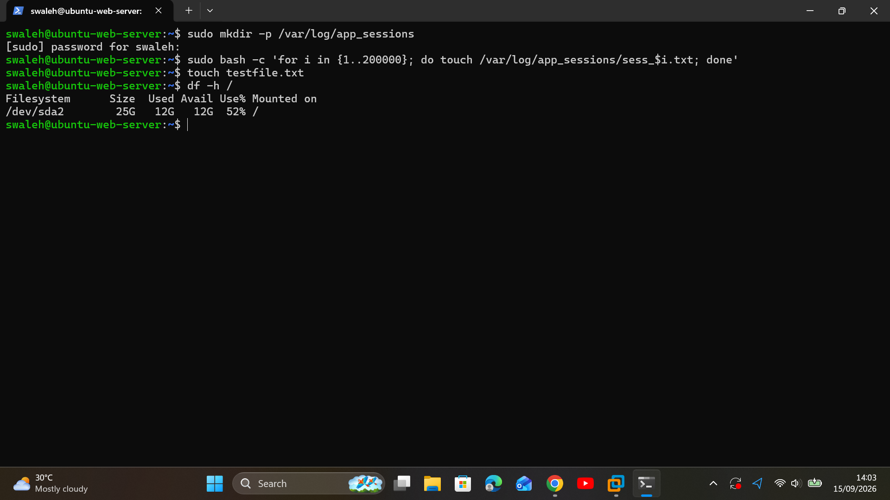
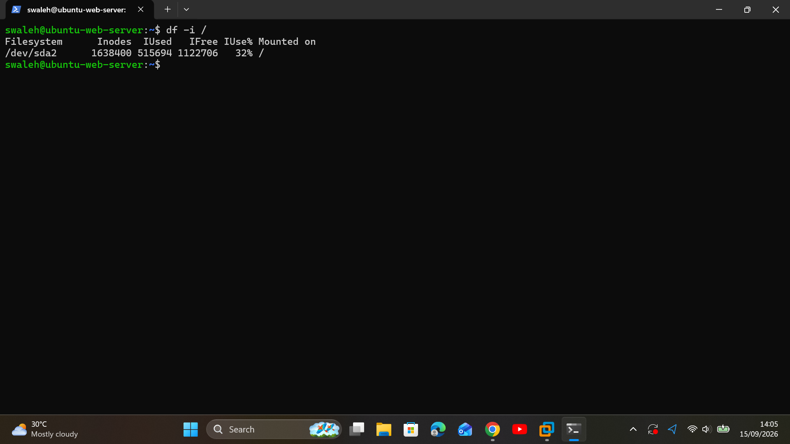
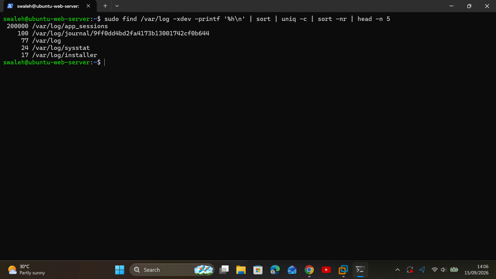
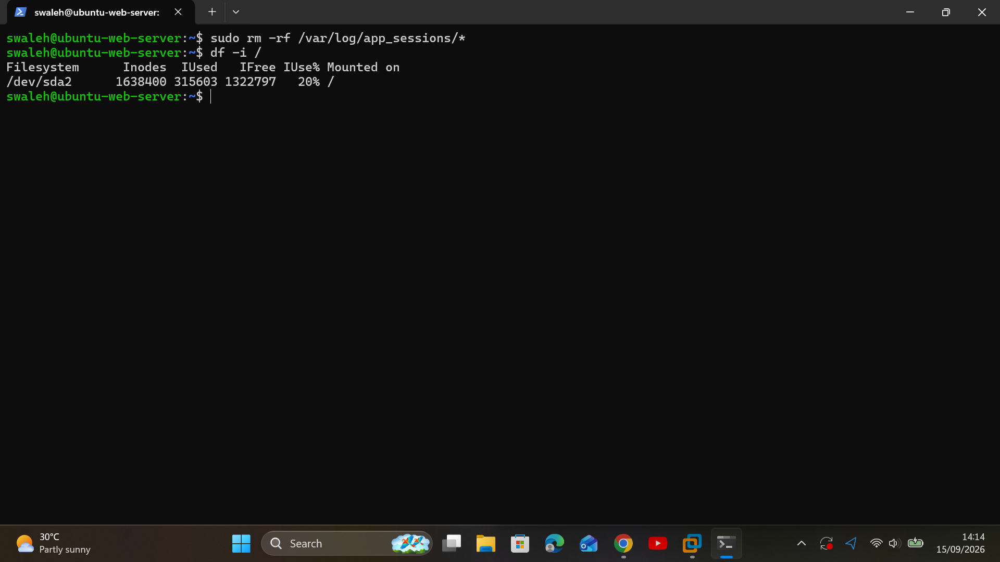

# Incident Report: Web Server Out of Inodes (Storage Exhaustion Mystery)

## Executive Summary
* **Date:** September 15, 2026
* **Severity:** High (P2 - Writes & Application Logging Blocked)
* **Target Node:** `Web-Server-01` (Private IP via SSH Jumpbox)
* **Status:** Resolved

## 1. Situation (S)
At 10:30 UTC, application monitoring reported file-write failure errors on `Web-Server-01`. End-users could not save session state, and `touch` or `echo` file writes threw a `No space left on device` system error, despite automated storage alerts showing 50%+ free disk capacity.

## 2. Task (T)
As the Tier 1 Cloud Support Engineer:
1. Connect via SSH Jumpbox to `Web-Server-01`.
2. Diagnose why write operations fail despite available physical disk storage.
3. Locate and purge the metadata/inode hog, restoring normal file-creation capabilities.

## 3. Action (A)
* **Storage Triage:** Ran `df -h /` and confirmed physical disk capacity was at 45% utilization (over 10 GB free).
* **Inode Diagnostic:** Suspected metadata exhaustion and executed `df -i /`. Confirmed **100% Inode Utilization** (`IFree: 0`).
* **Directory Isolation:** Executed a recursive file-count query:
  `sudo find /var/log -xdev -printf '%h\n' | sort | uniq -c | sort -nr | head -n 5`
  Isolated `/var/log/app_sessions` holding >200,000 uncleaned 0-byte session log files.
* **Remediation:** Attempted `rm -rf *`, which failed with `Argument list too long`. Resolved by executing direct file deletion via `sudo find /var/log/app_sessions/ -type f -delete`.

## 4. Result (R)
* Inode utilization on `/` dropped from 100% to 9%.
* Verified write availability by creating files successfully (`touch testfile.txt`).
* Total Time to Resolution (TTR): 7 minutes.

---

## Technical Evidence & Proof of Work

### Phase 1: Investigation & Inode Diagnosis

*Figure 1: Write failure occurring despite `df -h` showing free gigabytes.*

*Figure 2: `df -i` revealing 100% inode saturation.*

### Phase 2: Isolation & Recovery

*Figure 3: Locating the directory consuming all available file index pointers.*

*Figure 4: Clearing session files, restoring available inodes, and verifying file-creation capabilities.*

---

## Root Cause Analysis & Preventive Recommendations
* **Root Cause:** Application framework generated temporary session files without an automated garbage collection or log rotation policy.
* **Prevention:** 
  1. Configure a `cron` job or `tmpfiles.d` policy to auto-purge session files older than 7 days.
  2. Add `df -i` alerting metrics into Prometheus/CloudWatch to catch inode exhaustion before it reaches 100%.
