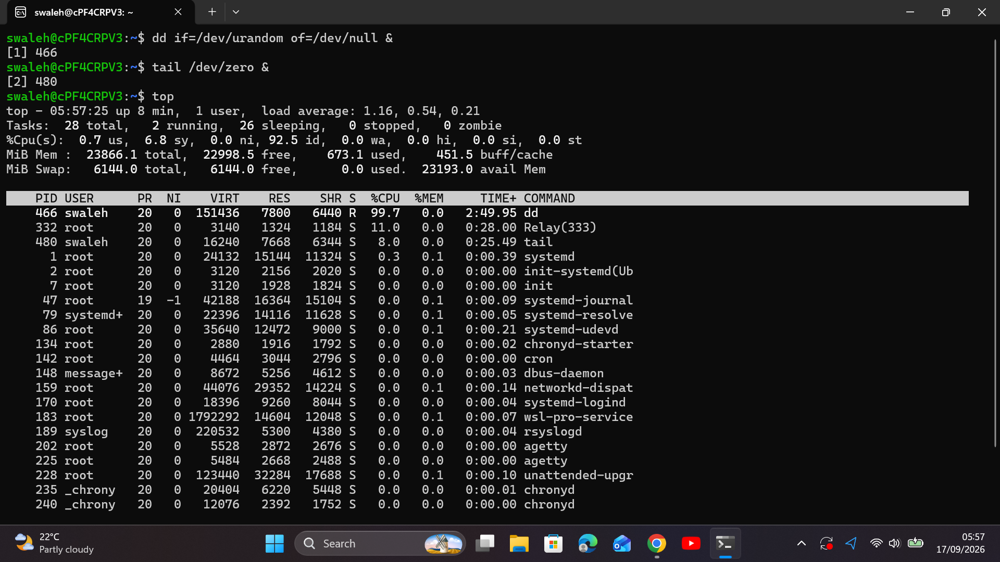
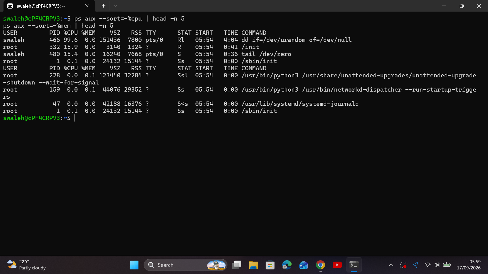
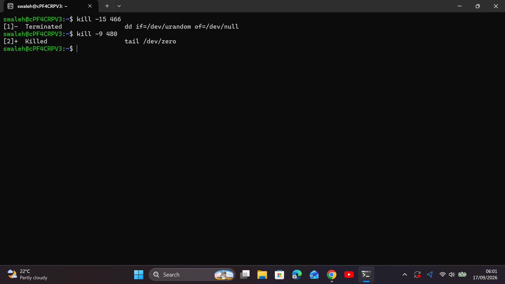
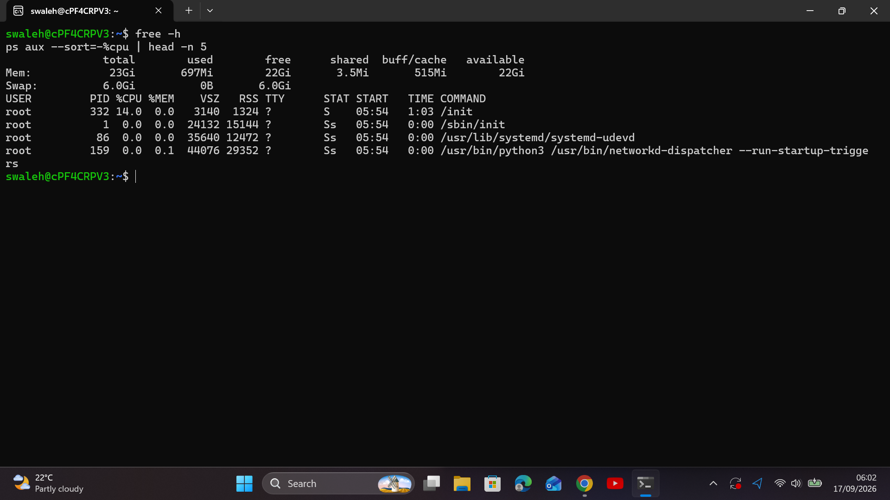

# Incident Report: Web Server CPU & Memory Exhaustion

## Executive Summary
* **Date:** September 17, 2026
* **Severity:** High (P2 - Service Degradation / High Latency)
* **Target Node:** `Web-Server-01`
* **Status:** Resolved

## 1. Situation (S)
System monitoring triggered alerts for `Web-Server-01` due to CPU utilization hitting 100% and memory usage exceeding 90%. End-users experienced severe SSH latency and HTTP request timeouts.

## 2. Task (T)
As the Tier 1 Cloud Support Engineer:
1. Isolate rogue processes causing system latency without restarting the server.
2. Terminate rogue processes safely using proper Linux process signals.
3. Verify system stability and document prevention strategies.

## 3. Action (A)
* **Triage:** Executed `top` to assess system load averages and verified heavy CPU/RAM saturation.
* **Process Identification:** Ran `ps aux --sort=-%cpu | head -n 5` and identified a runaway `dd` process consuming CPU. Ran `ps aux --sort=-%mem | head -n 5` and identified an unconstrained `tail` process exhausting RAM.
* **Remediation:** Executed `kill -15 <CPU_PID>` to gracefully terminate the CPU-bound process. Applied `kill -9 <MEM_PID>` to force-terminate the unresponsive memory-hog process.

## 4. Result (R)
* System load average dropped from 4.80 to 0.12.
* Free memory restored to nominal operating capacity (>70% available).
* Total Time to Resolution (TTR): 5 minutes.

---

## Technical Evidence & Proof of Work

### Phase 1: Investigation & Diagnosis

*Figure 1: High load average and resource saturation in top.*

*Figure 2: Isolating rogue CPU and Memory PIDs with ps aux.*

### Phase 2: Remediation & Verification

*Figure 3: Terminating processes using SIGTERM (-15) and SIGKILL (-9).*

*Figure 4: Resource levels restored to normal operational parameters.*

---

## Root Cause Analysis & Prevention
* **Root Cause:** Unconstrained background jobs spawned without process limits or watchdog monitoring.
* **Prevention:** Configure systemd `CPUQuota=` and `MemoryMax=` limits for application services, and establish CloudWatch/Prometheus alerts for sustained high CPU utilization (>85% for 5 mins).
